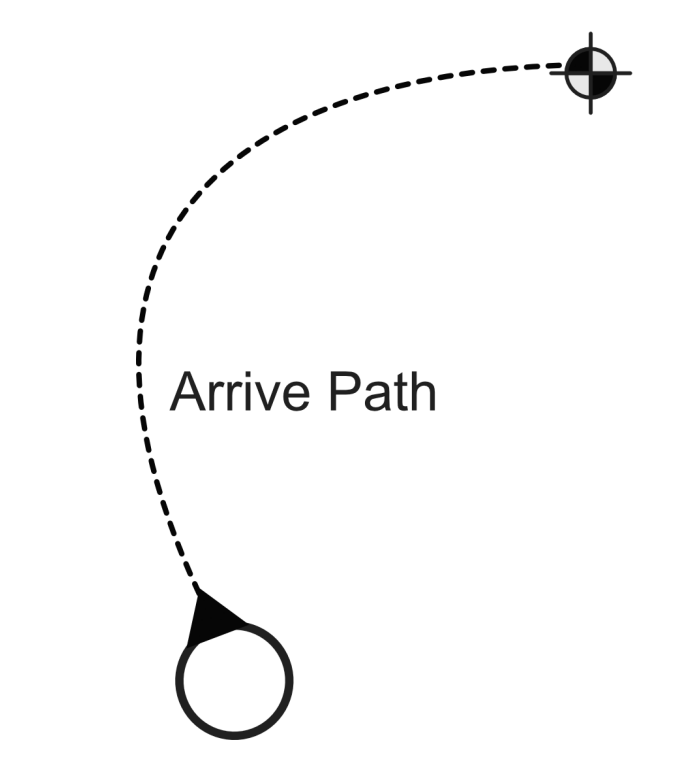
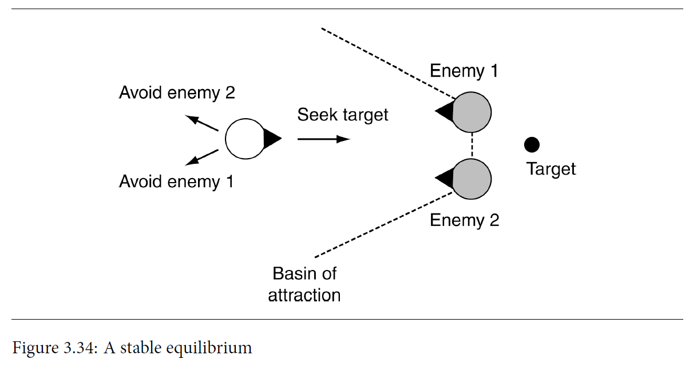

# IAV - Práctica 1

## Autores
- Yi (Laura) Wang Qiu [GitHub](https://github.com/LauraWangQiu)
- Agustín Castro De Troya [GitHub](https://github.com/AgusCDT)
- Ignacio Ligero Martín [GitHub](https://github.com/theligero)
- Alfonso Jaime Rodulfo Guío [GitHub](https://github.com/ARodulfo)

## Propuesta
Este proyecto es una práctica de la asignatura de Inteligencia Artificial para Videojuegos del Grado en Desarrollo de Videojuegos de la UCM, cuyo enunciado original es este: [Plaga de Ratas](https://narratech.com/es/inteligencia-artificial-para-videojuegos/percepcion-y-movimiento/plaga-de-ratas/).

Esta práctica consiste en recrear los comportamientos de una serie de personajes en una escena con obstáculos:

- Flautista: será el `Avatar` del jugador al que controlaremos mediante el teclado y ratón. Se podrá mover por toda la escena sin atravesar los obstáculos y podrá tocar la flauta y dejar de hacerlo.

- `Perro`: fiel compañero del `Avatar`. Perseguirá al `Avatar` con cierto control de llegada siempre y cuando no haya `Ratas` cerca, en ese caso, huye y deja de perseguir al `Avatar`.

- `Ratas`: se mueven erráticamente por la escena siempre y cuando el `Avatar` no toque su flauta, en ese caso, las `Ratas` empiezan a perseguir al `Avatar` con cierto control de llegada entre ellas y con el `Avatar` y puede producir que el `Perro` huya.


## Punto de partida

Se parte de un proyecto base de **Unity 2022.3.5f1** proporcionado por el profesor y disponible en este repositorio: [IAV-Movimiento](https://github.com/Narratech/IAV-Movimiento)

| Clases: ANIMACIONES | Información |
| - | - |
| Animador Animal | Establece un booleano de movimiento si se está moviendo o no dependiendo de la velocidad del rigidbody y de un _threshold_ al componente de Animator para que se reproduzca la animación que le corresponda. |
| Animador Avatar | Asigna el valor de la velocidad del rigidbody de la entidad al componente de Animator para que se reproduzca la animación que le corresponda.  |
| Seguimiento Camara | Calcula la posición interpolada entre el _target_ (el `Avatar`) y la propia entidad (la cámara) con cierta velocidad de suavizado y cierto _offset_ para producir un comportamiento de seguimiento durante el _FixedUpdate()_. |

| Clases: COMPORTAMIENTOS | Información |
| - | - |
| Control Jugador | Gestiona el movimiento del `Avatar` por el escenario. Sobreescribe el método _GetDireccion()_ de ComportamientoAgente para devolver la dirección que le corresponde según el input WASD o flechas de dirección del teclado. |
| Huir -> HuirDeUnGrupo | Maneja el comportamiento de Huida de otro Agente. Sobreescribe el método _GetDireccion()_ de ComportamientoAgente. (Clase a implementar) |
| Llegada | Gestiona el comportamiento de Seguimiento con Llegada de una Agente hacia otro. Recibe valores para la aceleración y la velocidad máxima, la distancia al objetivo, y los dos radios claves entre los cuáles el Agente perseguidor decelera hasta llegar a la distancia objetivo. Sobreescribe el método _GetDireccion()_ de ComportamientoAgente. (Clase a implementar) |
| Merodear | Componente que hace que las `Ratas` deambulen mientras no se toque la flauta. Tiene variables para los tiempos y direcciones utilizadas para las orientaciones. Sobreescribe el método _GetDireccion()_ de ComportamientoAgente. (Clase a implementar) |
| Separacion | Se encarga de que las entidades no se solapen cuando sigan a otra entidad. Establece valores para los targets, el umbral de activación y el coeficiente de repulsión. Sobreescribe el método _GetDireccion()_ de ComportamientoAgente. (Clase a implementar)  |
| Tocar Flauta | Se encarga de gestionar las acciones cuando se toca o no la flauta. Si pulsamos clic derecho activamos la flauta y con ello los efectos audiovisuales de la misma, además de activar los comportamientos de Separación y Llegada de las `Ratas`. Si dejamos de clicar se desactiva todo lo anterior y empieza el Merodeo de las `Ratas`. |

| Clases: GENERALES | Información |
| - | - |
| Agente | Controlador de todos los comportamientos que puede realizar el _agente_. Tiene valores de velocidad, rotación y aceleración (tanto actuales como máximas) así como diferentes métodos de actuación en base a la mezcla de comportamientos que se le pida (véase peso o prioridad). Los valores de velocidad, rotación y aceleración serán actualizados según físicas o no en función de si el _agente_ en cuestión es cinemático o no.|
| Comportamiento Agente | Clase abstracta sobre la que parten el resto de comportamientos. Contiene un float peso e int prioridad, que pueden ser o no utilizados, si el _agente_ en cuestión tiene habilitada la mezcla por peso o prioridad, para la combinación de comportamientos. |
| Direccion | Instrucciones básicas de cualquiera de los _agentes_ de la escena. Éstas se encargan de corregir el movimiento dinámicamente mediante aceleraciones. Contiene un Vector3 lineal que almacena su velocidad lineal y un float angular que almacena su velocidad angular. |
| Gestor Juego | Controlador de eventos y de _agentes_ de la escena. Tiene control sobre la tasa de fotogramas por segundo, el contador de rat, el propio escenario y la cámara. Se encarga de la generación y destrucción de `Ratas`, del reinicio de la escena, de mostrar u ocultar los elementos de la escena, de cambiar el frame rate y de cambiar el punto de vista de la cámara. |

## Diseño de la solución

A. Modificar el input de tocar la flauta para que se realice con el `clic derecho` e implementar una `caja de texto` y un `botón` para poder introducir un número de `Ratas` específico.

B. Para empezar a programar el acompañamiento del `Perro` al `Avatar`, primero será necesario conocer tanto el funcionamiento del algoritmo empleado como su representación visual final.

En primer lugar, el objetivo del algoritmo de llegada será ralentizarse para que llegue a la ubicación exacta.

<div style="text-align: center;">
    
    <p>
    [Page 61 - Figure 3.9: Arriving] IAN MILLINGTON, <i>AI for Games</i>, Third Edition, 2019.
    </p>
</div>
Dicho algoritmo utiliza dos radios: uno de llegada, que permite al personaje acercarse lo suficiente al objetivo sin importar el margen de error, y otro de ralentización (mucho más grande que el anterior), que ralentiza al personaje cuando pasa dicho radio. En éste último, se iguala su velocidad actual con una velocidad máxima establecida previamente. Por contra, en el de llegada, su velocidad se establece a cero. Además, en la zona entre los dos radios, se calcula una interpolación intermedia, controlada por la distancia hasta el objetivo.

La estructura del algoritmo se puede representar a través del siguiente _pseudo-código_:

```
class Llegada:
    character: Kinematic
    target: Kinematic

    maxAcceleration: float
    maxSpeed: float

    # The radius for arriving at the target.
    targetRadius: float

    # The radius for beginning to slow down.
    slowRadius: float

    # The time over which to achieve target speed.
    timeToTarget: float = 0.1

    function getSteering() -> SteeringOutput:
        result = new SteeringOutput()

        # Get the direction to the target.
        direction = target.position - character.position
        distance = direction.length()

        # Check if we are there, return no steering.
        if distance < targetRadius:
            return null

        # If we are outside the slowRadius, then move at max speed.
        if distance > slowRadius:
            targetSpeed = maxSpeed
        # Otherwise calculate a scaled speed.
        else:
            targetSpeed = maxSpeed * distance / slowRadius

    # The target velocity combines speed and direction.
    targetVelocity = direction
    targetVelocity.normalize()
    targetVelocity *= targetSpeed

    # Acceleration tries to get to the target velocity.
    result.linear = targetVelocity - character.velocity
    result.linear /= timeToTarget

    # Check if the acceleration is too fast.
    if result.linear.length() > maxAcceleration:
        result.linear.normalize()
        result.linear *= maxAcceleration

    result.angular = 0
    return result
```

C. Implementar el movimiento del `Perro` para la huida causado por la cercanía de las `Ratas` respecto al `Perro`.

La situación es la que se muestra en la siguiente imagen:

<div style="text-align: center;">
    
    <p>
    [Page 101 - Figure 3.34: A stable equilibrium] IAN MILLINGTON, <i>AI for Games</i>, Third Edition, 2019.
    </p>
</div>

El círculo blanco representa al `Perro` y su comportamiento normal es seguir al Target, el `Avatar`. Sin embargo, hay enemigos (las `Ratas`) que hacen que quiera evitarlos pasando a un comportamiento de huida y siendo un comportamiento más prioritario. Esto significa que hay comportamientos de dirección combinados: llegada y huida con prioridad del comportamiento de huida frente al de llegada.

El pseudocódigo del algoritmo de huida sería muy parecido al de _seek_ pero intercambiando la posición del target con el de la propia entidad. Aún así, en este caso hablamos de huir de un grupo de `Ratas` y no de huir de solo un target por lo que habría que modificar algo más:
```
class Static:
    position: Vector
    orientation: float

class KinematicSteeringOutput:
    velocity: Vector
    rotation: float

class HuirDeUnGrupo:
    character: Static
    # List of targets.
    targets: Static[]

    maxSpeed: float

    function newOrientation(current: float, velocity: Vector) -> float:
        # Make sure we have a velocity.
        if velocity.length() > 0:
            # Calculate orientation from the velocity.
            return atan2(-static.x, -static.z)

        # Otherwise use the current orientation
        else:
            return current


    function getSteering() -> KinematicSteeringOutput:
        result = new KinematicSteeringOutput()

        # Calculate the average point of all targets.
        averagePosition = new Vector()
        for target in targets:
            averagePosition += target.position
        averagePosition /= len(targets)

        # Obtain the direction to move away from the average point of the targets.
        result.velocity = character.position - averagePosition

        # The velocity is along this direction, at full speed.
        result.velocity.normalize()
        result.velocity *= maxSpeed

        # Face in the direction we want to move.
        character.orientation = newOrientation(
                character.orientation,
                result.velocity)
            
        result.rotation = 0
        return result
```

Se podría modificar un poco más haciendo que solo compruebe dentro de un radio respecto al character (`Perro`) en vez de con todos los targets que estén en la escena:

```
# Radius or range with respect to the character
fleeRange: float

for target in targets:
    if (character.position - target.position).length() <= fleeRange:
        averagePosition += target.position
```

D. El merodeo de las `Ratas` en ausencia de la música emanada por la flauta viene implementado haciendo uso de tres algoritmos distintos en relación de herencia.

De esta forma obtenemos un resultado suave dentro de la aleatoridad del movimiento de estas.

Por un lado tenemos el  _pseudo-código_ de `Align` (alineamiento).
Este equipara la orientación del sujeto que lo usa a la orientacción de un objetivo, rotando en el proceso por el camino más corto

Hace uso de dos variables. 
Un radio dentro del cuál la rotación del sujeto deberá ralentizarse lentamente hasta llegar al radio deseado (slowRadius) y un radio que representa el radios necesario para llegar a la orientación elegida (targetRadius).

```
class Alineamiento:
	character: Kinematic
	target: Kinematic

	maxAngularAcceleration: float
	maxRotation: float

	#The radius for arriving at the target.
	targetRadius: float

	#The radius for beginning to slow down.
	slowRadius: float

	#The time over which to achieve target spedd.
	timeToTarget: float = 0.1

	function getSteering() -> SteeringOutput:
		result = new SteeringOutput();
		
		#Get the naive direction to the target.
		rotation = target.orientation - character.orientation

		#Map the result to the (-pi, pi) interval.
		rotation = mapToRange(rotation)
		rotationSize = abs(rotation)

		#Check if we are there, return no steering.
		ir rotationSIze < targetRadius:
			return null

		#If we are outside the slowRadius, then use maximun rotation.
		if rotationSize > slowRadius:
			targetRotation = maxRotation

		#Otherwise calculate a scaled rotation.
		else:
			targetRotation = 
				maRotation * rotationSize / slowRadius

		

		#The final target rotation combines speed ( already in the 
		#variable) and direction.
		targetRotation *= rotation / rotationSize

		#Acceleration tries to get to the target rotation.
		result.angular = targetRotation - character.rotation
		result.angular /= timeToTarget
	
		#Check if the acceleration is too great.
		angularAcceleration = abs(result.angular)
		if angularAcceleration > maxAngularAcceleration:
			result.angular /= angularAcceleration
			result.angular	*= maxAngularAcceleration

		result.linear = 0
		return result

```
A continuación tenemos el  _pseudo-código_ de `Face` (encarar), que hace uso de Align para modificar la orientación del quién haga uso de este para que apunte al objetivo seleccionado.
Se diferencia de Align en que no solo se iguala orientación, si no que se mira hacia un objetivo en base a dicha orientación original.
```
class Encarar extends Alineamiento:
	#Overrides the Align.target member.
	target: Kinematic

	#... Other data is derived fromt he superClass...
	#Implemented as it was in Pursue
	function getSteering -> SteeringOutput: 
		#1. Calculate the target to delegate to align
		#Work out the direction to target.
		direction = target.position - character.position
		
		#Check for a zero direction, and make no change if so.
		if direction.length() == 0:
			return target

		#2. Delegate to align.
		Align.target = explicitTarget
		Align.target.orientation = atan2(-direction.x, direction.z)
		return Align.getSteering
```
Finalmente tenemos el  _pseudo-código_ de `Wander` (merodeo) que se encarga de fijar un objetivo aleatorio situado unos pasos por delante del sujeto que hace uso de Wander y lo sigue.

Hace uso tanto de Face como de Align puesto que el merodeo, aún siendo aleatorio se hace siguiendo un movimiento coherente tick a tick.

```
class Merodear extends Encarar:
	# The radius and forward offset of the wander circle.
	wanderOffset: float
	wanderRadius: float
																									
	# The maximum rate at which the wander orientation can change. 
	wanderRate: float

	# The current orientation of the wander target. 
	wanderOrientation: float
		
	# The maximum acceleration of the character. 
	maxAcceleration: float

	# Again we don't need a new target.
	#... Other data is derived from the superclass

	function getSteering()-> SteeringOutput:
		# 1. Calculate the target to delegate to face
		# Update the wander orientation.
		wanderOrientation += randomBinomial() * wanderRate

		# Calculate the combined target orientation.
		targetOrientation = wanderOrientation + character.orientation
		# Calculate the center of the wander circle.
		target = character.position + wanderOffset * 								character.orientation.asVector()
		#Calculate the target location.
		target += wanderRadius * targetOrientation.asVector()

		# 2. Delegate to face.
		result = Face.getSteering()

		# 3. Now set the linear acceleration to be at full
		# acceleration in the direction of the orientation. 
		result.linear = maxAcceleration * character. orientation.asVector()

		# Return it. 
		return result
```

E. Cuando el `Avatar` toca la flauta, se produce el desplazamiento en bandada (hipnosis) de las `Ratas`, con movimiento dinámico en formación (seguimiento, cohesión y separación) y control de llegada hasta las proximidades del `Avatar`. Las `Ratas` encaran al `Avatar` si toca la flauta.

El pseudocódigo utilizado para los comportamientos de Llegada, Seguimiento y el cálculo de la posición media de las `Ratas` del `Perro` serán reutilizados para las `Ratas`. En adición a estos comportamientos añadiremos uno de Separación:

```
class Separacion:
	character: Kinematic
 	maxAcceleration: float

 	# A list of potential targets.
 	targets: Kinematic[]

 	# The threshold to take action.
 	threshold: float

 	# The constant coefficient of decay for the inverse square law.
 	decayCoefficient: float

 	function getSteering()-> SteeringOutput:
 		result = new SteeringOutput()
 		# Loop through each target.
 		for target in targets:
 			# Check if the target is close.
 			direction = character.position - target.position
 			distance = direction.length()
			if distance < threshold:
 				# Calculate the strength of repulsion
 				# (here using the inverse square law).
 				strength = min(
 					decayCoefficient / (distance * distance),
 					maxAcceleration)

 				# Add the acceleration.
 				direction.normalize()
 				result.linear += strength * direction
 		return result
```

Queremos comprobar la distancia entre el _character_ (una Rata), y los _targets_. En el caso de que la _distance_ (distancia) sea menor que _threshold_ (umbral) actúa una especie de fuerza de repulsión. Esto hará que las `Ratas` no lleguen a agolparse en el mismo punto evitando colisiones indeseadas.

## Pruebas y métricas

| Pruebas | Métricas | Links |
|:-:|:-:|:-:|
| **Característica A** | | |
| Probar que el `Avatar` toque la flauta con el clic derecho | Clic derecho, ver que se reproduce música y sale un radio | _link no disponible_ |
| Probar que al introducir un número N de `Ratas` en la caja de texto se produzca en la escena | Introducimos valores no númericos (a, ?, ...), valores numéricos negativos (-1, -1000), valores numéricos cualesquiera en la caja de texto y ENTER | _link no disponible_ |
| Sin obstáculos, probar que el movimiento del `Avatar` funcione con el clic izquierdo | Desactivamos los obstáculos, clic izquierdo y ver que se mueve hacia el punto especificado | _link no disponible_ |
| Con obstáculos, probar que el movimiento del `Avatar` funcione con el clic izquierdo | Con obstáculos activados, clic izquierdo y ver que se mueve hacia el punto especificado | _link no disponible_ |
| **Característica B** | | |
| Probar que el `Perro` sigue al `Avatar` allá a donde vaya | Vamos caminando por el terreno y se va a asegurando que la implementación esté correcta | _link no disponible_ |
| Probar que el `Perro` se mantiene a cierta distancia del `Avatar`, de manera que no sea molesto para éste | Asegurarse de que la distancia adoptada por el `Perro` es correcta y se combina bien con el seguimiento | _link no disponible_ |
| Probar que el `Perro` siempre mira hacia el `Avatar`, independientemente de su posición en el espacio bidimensional | Asegurarse de que esta regla se cumple | _link no disponible_ |
| **Característica C** | | |
| Probar que cambia de comportamiento de persecución al de huida | Tocamos la flauta con el clic derecho (se acercan las `Ratas` y el `Perro` huye) | _link no disponible_ |
| Probar que durante el comportamiento de huida, se quiten las `Ratas` que lo perjudican y ver que vuelve a perseguir al `Avatar` | Tocamos la flauta con el clic derecho (se acercan las `Ratas` y el `Perro` huye) y dejar de tocar la flauta (el `Perro` vuelve a perseguir) |  _link no disponible_|
| Probar que a partir de radios diferentes alrededor del `Perro`, el `Perro` huya | Tocamos la flauta con el clic derecho (se acercan las `Ratas` y el `Perro` huye) y cambiamos en el inspector el radio | _link no disponible_ |
| **Característica D** | | |
| Probar que una vez el `Avatar` deja de tocar la flauta, las `Ratas` comienzan un merodeo errático y desordenado, hasta que el `Avatar` empiece a tocar de nuevo. | Click derecho para activar y desactivar la flauta. | _link no disponible_ |
| Probar con diferentes valores del wander offset y del wander radius para observar si las `Ratas` merodean de una forma más compacta (como grupo) o menos. | Introducir en el wander radius y offset valores más pequeños y más grandes.  | _link no disponible_ |
| **Característica E** | | |
| Probar con un número elevado de `Ratas` que cuando se toca la flauta sigan al `Avatar` y eviten agolparse entre ellas | Número de `Ratas`: 50-100 | _link no disponible_ |
| Probar con diferentes distancias en búsqueda de los valores más ajustados para la Separación entre `Ratas` | Distance: 1 | _link no disponible_ |

## Ampliaciones

No se han realizado ampliaciones hasta el momento.

## Producción

Las tareas se han realizado y el esfuerzo ha sido repartido entre los autores. Observa la tabla de abajo para ver el estado y las fechas de realización de las mismas. Puedes visitar nuestro proyecto de GitHub en el siguiente [link](https://github.com/orgs/IAV24-G02/projects/1).


| Estado  |  Tarea  |  Fecha  |  
|:-:|:--|:-:|
| ✔ | Diseño: Primer borrador | 14-02-2024 |
| ✔ | Característica A: Tocar flauta con el clic derecho | 01-02-2024 |
| ✔ | Característica A: Introducir número de `Ratas` específico | 11-02-2024 |
| ✔ | Característica B: Seguimiento del `Perro` al `Avatar` | 12-02-2024 |
| ✔ | Característica C: Huida del `Perro` | 17-02-2024 |
|  | Característica D: Merodear de las `Ratas` | ..-..-2024 |
|  | Característica E: Seguimiento y Control de llegada de las `Ratas` | ..-..-2024 |
|  |  OTROS  | |
| ✔ | Movimiento del `Avatar` con el clic izquierdo | 15-02-2024 |
|  |  OPCIONALES  | |
|  | Generador pseudoaleatorio | ..-..-2024 |
|  | Competición de flautistas | ..-..-2024 |
|  | Distracción de las `Ratas` con trozos de queso | ..-..-2024 |
|  | Percepción del `Perro` mediante la vista | ..-..-2024 |
|  | Evasión de los obstáculos mediante la vista | ..-..-2024 |
|  | Menú | ..-..-2024 |
|  | HUD | ..-..-2024 |

## Licencia

Yi (Laura) Wang Qiu, Agustín Castro De Troya, Ignacio Ligero Martín, Alfonso Jaime Rodulfo Guío, autores de la documentación, código y recursos de este trabajo, concedemos permiso permanente a los profesores de la Facultad de Informática de la Universidad Complutense de Madrid para utilizar nuestro material, con sus comentarios y evaluaciones, con fines educativos o de investigación; ya sea para obtener datos agregados de forma anónima como para utilizarlo total o parcialmente reconociendo expresamente nuestra autoría.

Una vez superada con éxito la asignatura se prevee publicar todo en abierto (la documentación con licencia Creative Commons Attribution 4.0 International (CC BY 4.0) y el código con licencia GNU Lesser General Public License 3.0).

## Referencias

Los recursos de terceros utilizados son de uso público.

- *AI for Games*, Ian Millington.
- [Kaykit Medieval Builder Pack](https://kaylousberg.itch.io/kaykit-medieval-builder-pack)
- [Kaykit Dungeon](https://kaylousberg.itch.io/kaykit-dungeon)
- [Kaykit Animations](https://kaylousberg.itch.io/kaykit-animations)
